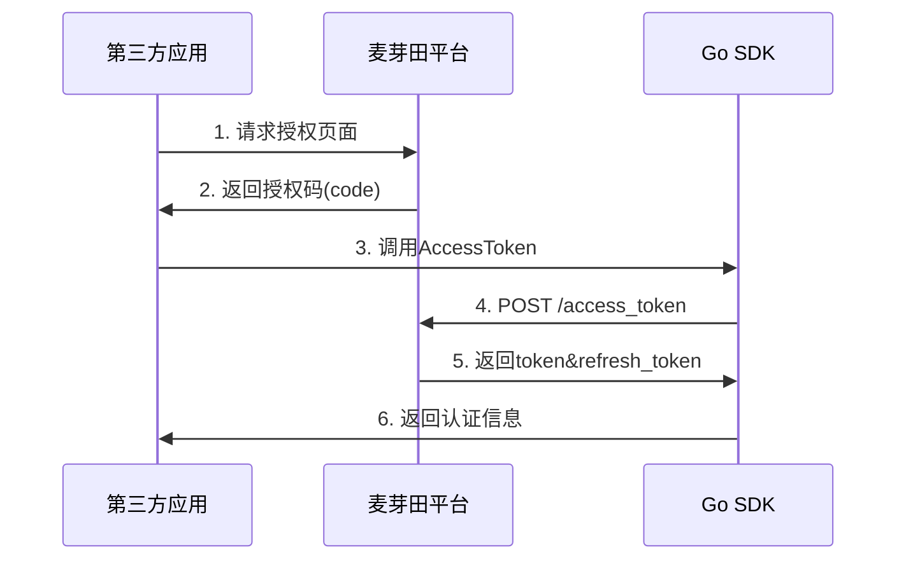
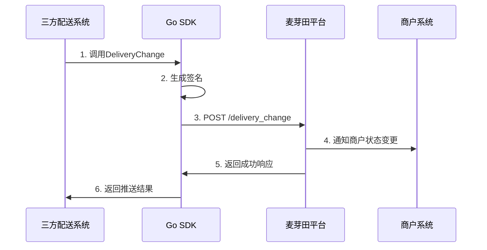
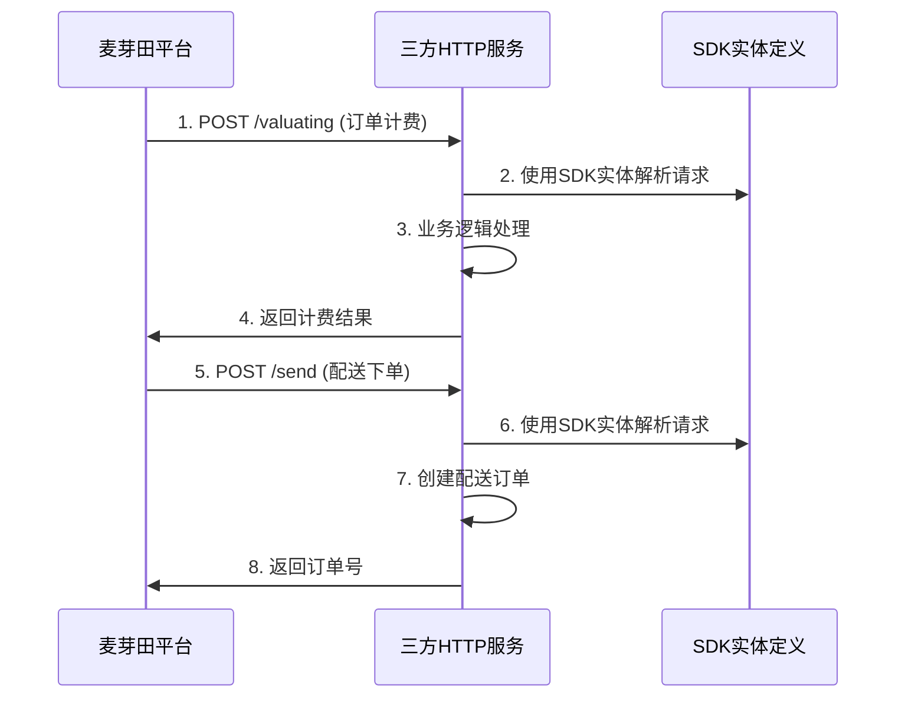

# 麦芽田配送开放平台 Go SDK 架构说明

[](https://golang.org/dl/)
[](LICENSE)

## 📖 目录

- [架构概述](#架构概述)
- [核心设计理念](#核心设计理念)
- [模块架构](#模块架构)
- [接口分类](#接口分类)
- [数据流向](#数据流向)
- [安全机制](#安全机制)
- [性能优化](#性能优化)
- [扩展性设计](#扩展性设计)

## 🏗️ 架构概述

麦芽田配送开放平台 Go SDK 采用**分层架构**设计，遵循**单一职责**、**开闭**、**依赖倒置**等SOLID原则，为三方配送服务商提供稳定、高效、易用的API调用能力。

### 总体架构图

```
┌─────────────────────────────────────────────────────────────┐
│                    应用层 (Application)                      │
├─────────────────────────────────────────────────────────────┤
│                  SDK 接口层 (Interface)                      │
│  ┌─────────────────┐              ┌─────────────────┐       │
│  │  Sender APIs    │              │ Receiver Models │       │
│  │ (主动调用接口)    │              │  (回调接口实体)   │       │
│  └─────────────────┘              └─────────────────┘       │
├─────────────────────────────────────────────────────────────┤
│                   业务逻辑层 (Business)                       │
│  ┌─────────────────┐  ┌─────────────────┐  ┌────────────┐   │
│  │   签名验证      │  │   请求构建      │  │  响应解析   │   │
│  │  (HmacSHA256)   │  │ (Request Build) │  │(Response)  │   │
│  └─────────────────┘  └─────────────────┘  └────────────┘   │
├─────────────────────────────────────────────────────────────┤
│                   传输层 (Transport)                         │
│  ┌─────────────────┐  ┌─────────────────┐  ┌────────────┐   │
│  │   HTTP客户端    │  │   连接池管理    │  │   重试机制  │   │
│  │  (HTTP Client)  │  │(Connection Pool)│  │  (Retry)   │   │
│  └─────────────────┘  └─────────────────┘  └────────────┘   │
├─────────────────────────────────────────────────────────────┤
│                   基础设施层 (Infrastructure)                 │
│  ┌─────────────────┐  ┌─────────────────┐  ┌────────────┐   │
│  │   配置管理      │  │     日志记录    │  │   工具函数  │   │
│  │  (Config)       │  │   (Logging)     │  │  (Utils)   │   │
│  └─────────────────┘  └─────────────────┘  └────────────┘   │
└─────────────────────────────────────────────────────────────┘
```

## 🎯 核心设计理念

### SOLID原则应用

| 原则 | 应用场景 | 具体实现 |
|------|----------|----------|
| **单一职责** (S) | 模块设计 | 每个package专注单一功能：client负责HTTP通信，models负责数据定义，utils负责工具函数 |
| **开闭原则** (O) | 接口扩展 | 通过interface设计，新增API无需修改现有代码 |
| **里氏替换** (L) | HTTP客户端 | 不同HTTP客户端实现可互相替换 |
| **接口隔离** (I) | API分组 | Sender和Receiver接口分离，避免不必要的依赖 |
| **依赖倒置** (D) | 配置注入 | 高层模块依赖配置抽象，而非具体实现 |

### KISS & DRY & YAGNI原则

- **KISS (简单至上)**: API设计简洁直观，一个方法完成一个功能
- **DRY (避免重复)**: 公共逻辑抽取到utils包，签名、重试等逻辑复用
- **YAGNI (精益求精)**: 只实现当前必需的功能，避免过度设计

## 🗂️ 模块架构

### 目录结构说明

```
myt-go-sdk/
├── client/              # 📡 HTTP客户端实现
│   ├── config.go       # ⚙️ 配置管理 (Builder模式)
│   └── http_client.go  # 🌐 HTTP客户端实现
├── models/              # 📋 数据模型定义
│   ├── types/          # 🏷️ 公共类型和枚举常量
│   │   ├── types.go    # 基础类型定义
│   │   └── constants.go # 枚举常量定义
│   ├── sender/         # 📤 Sender接口 (三方→麦芽田)
│   │   ├── api/        # 🔌 API接口实现
│   │   │   ├── access_token.go    # 授权相关
│   │   │   ├── delivery_change.go # 配送状态推送
│   │   │   └── location_change.go # 轨迹推送
│   │   └── entity/     # 🏗️ 请求响应实体
│   │       ├── auth/   # 授权实体
│   │       ├── delivery/ # 配送实体
│   │       └── express/  # 快递实体
│   └── receiver/       # 📥 Receiver接口 (麦芽田→三方)
│       └── entity/     # 🏗️ 回调接口实体
│           ├── auth/   # 授权实体
│           ├── account/ # 账户相关
│           ├── city/    # 城市运力
│           └── delivery/ # 配送相关
├── utils/              # 🛠️ 工具函数
│   └── tools.go       # 签名生成、时间处理等
├── examples/           # 📚 使用示例
│   └── sender/        # Sender接口示例
└── README.md          # 📖 项目说明文档
```

## 🔄 接口分类

### Sender 接口（三方 → 麦芽田）

**特点**: 三方配送服务商**主动调用**麦芽田平台接口

| 接口类型 | Command | 必接 | 功能说明 | 实现状态 |
|----------|---------|------|----------|----------|
| **授权管理** | `access_token` | ✅ 是 | 获取访问令牌 | ✅ 已实现 |
| **令牌刷新** | `refresh_token` | ✅ 是 | 刷新访问令牌 | ✅ 已实现 |
| **状态推送** | `delivery_change` | ✅ 是 | 推送配送状态变更 | ✅ 已实现 |
| **轨迹推送** | `location_change` | ✅ 是 | 推送快递轨迹信息 | ✅ 已实现 |

#### 使用示例

```go
// 创建Sender客户端
config := client.NewConfigBuilder().
BaseURL("https://open-api.maiyatian.com").
APIKey("your_app_key").
APISecret("your_app_secret").
Build()

sender := api.NewDeliverySender(config)

// 获取访问令牌
resp, err := sender.AccessToken(ctx, "", &AccessTokenReq{...})

// 推送配送状态
resp, err := sender.DeliveryChange(ctx, token, &DeliveryChangeReq{...})
```

### Receiver 接口（麦芽田 → 三方）

**特点**: 麦芽田平台**主动回调**三方配送服务商接口（需三方实现HTTP服务）

| 接口类型 | Command | 必接 | 功能说明 | 实现方 |
|----------|---------|------|----------|--------|
| **运力查询** | `city_capacity` | 📋 必接 | 获取城市运力信息 | 三方实现 |
| **订单计费** | `valuating` | 📋 必接 | 订单运费计算 | 三方实现 |
| **配送下单** | `send` | 📋 必接 | 创建配送订单 | 三方实现 |
| **小费管理** | `tips` | 📋 必接 | 添加配送小费 | 三方实现 |
| **订单取消** | `cancel/precancel` | 📋 必接 | 取消配送订单 | 三方实现 |
| **订单查询** | `query_info` | 📋 必接 | 查询配送详情 | 三方实现 |
| **位置查询** | `rider_location` | 📋 必接 | 获取骑手位置 | 三方实现 |
| **余额查询** | `balance` | 📋 必接 | 查询账户余额 | 三方实现 |
| **授权解绑** | `token_unbind` | 📋 必接 | 处理授权解绑 | 三方实现 |

> **重要提醒**: Receiver接口需要三方配送服务商自己实现HTTP服务来接收麦芽田的回调请求。SDK提供完整的实体定义作为开发参考。

## 🌊 数据流向

### OAuth2授权流程



### 配送状态推送流程



### 配送回调流程



## 🛡️ 安全机制

### 签名验证 (HmacSHA256)

**签名生成规则**:
1. 提取请求体中的 `app_key`, `token`, `timestamp`, `data` 字段
2. 提取请求路径中的 `command` 参数
3. 按**字典序**排序所有参数
4. 用半角逗号连接生成 `dataToSign` 字符串
5. 使用 `appSecret` 计算 HmacSHA256 值
6. 结果进行 URL安全的 Base64 编码

```go
// 签名生成示例
func GenerateSignature(appSecret, dataToSign string) string {
    h := hmac.New(sha256.New, []byte(appSecret))
    h.Write([]byte(dataToSign))
    return base64.URLEncoding.EncodeToString(h.Sum(nil))
}
```

### 请求安全

| 安全措施 | 实现方式 | 说明 |
|----------|----------|------|
| **HTTPS传输** | 强制HTTPS | 所有API调用必须使用HTTPS协议 |
| **请求签名** | HmacSHA256 | 防止请求篡改和重放攻击 |
| **Token认证** | Bearer Token | API调用需要有效的访问令牌 |
| **时间戳验证** | 请求时间戳 | 防止重放攻击 |
| **参数校验** | 严格校验 | 对所有输入参数进行类型和格式校验 |

## ⚡ 性能优化

### HTTP连接池管理

```go
type HTTPClientConfig struct {
    // 连接池配置
    MaxConnections        int           // 最大连接数: 50
    MaxConnectionsPerHost int           // 每主机最大连接数: 10
    KeepAliveTimeout      time.Duration // 连接保持时间: 30s
    
    // 超时配置
    RequestTimeout        time.Duration // 请求超时: 60s
    ConnectionTimeout     time.Duration // 连接超时: 30s
    ReadTimeout          time.Duration // 读取超时: 60s
}
```

### 智能重试机制

**重试策略**: 指数退避 + 随机抖动

```go
type RetryConfig struct {
    MaxAttempts int           // 最大重试次数: 3
    BaseDelay   time.Duration // 基础延迟: 1s
    MaxDelay    time.Duration // 最大延迟: 30s
    
    // 重试条件
    RetryableErrors []string  // 可重试的错误类型
    RetryableStatus []int     // 可重试的HTTP状态码 (5xx)
}
```

### 内存优化

- **对象池**: 复用HTTP请求对象，减少GC压力
- **流式处理**: 大响应体采用流式读取
- **延迟加载**: 按需加载配置和实体定义

## 🔧 扩展性设计

### 配置管理 (Builder模式)

```go
config := client.NewConfigBuilder().
    BaseURL("https://open-api.maiyatian.com").
    APIKey("your_app_key").
    APISecret("your_app_secret").
    MaxConnections(100).
    RequestTimeout(30 * time.Second).
    RetryMaxAttempts(5).
    EnableLogging(true).
    Build()
```

### 插件化设计

| 插件类型 | 扩展点 | 用途 |
|----------|--------|------|
| **中间件** | HTTP请求/响应 | 日志记录、性能监控、错误处理 |
| **序列化器** | 数据序列化 | 支持不同的序列化格式 |
| **存储适配器** | Token存储 | 支持不同的存储后端 |
| **负载均衡** | 请求分发 | 支持多个API端点 |

### 接口抽象

```go
// HTTP客户端接口
type HTTPClient interface {
    Do(req *http.Request) (*http.Response, error)
}

// 配置接口
type Config interface {
    GetBaseURL() string
    GetAPIKey() string
    GetAPISecret() string
}

// 日志接口
type Logger interface {
    Debug(args ...interface{})
    Info(args ...interface{})
    Error(args ...interface{})
}
```

## 📊 监控与诊断

### 关键指标

| 指标类型 | 监控项 | 用途 |
|----------|--------|------|
| **性能指标** | 响应时间、QPS、成功率 | 性能监控 |
| **错误指标** | 错误率、错误类型分布 | 故障诊断 |
| **业务指标** | API调用量、Token刷新频率 | 业务分析 |
| **资源指标** | 连接池使用率、内存消耗 | 资源优化 |

### 日志记录

```go
type LogConfig struct {
    EnableLogging    bool // 是否启用日志
    LogRequestBody   bool // 是否记录请求体
    LogResponseBody  bool // 是否记录响应体
    LogLevel        string // 日志级别
}
```

## 🔄 版本兼容性

### API版本管理

- **向后兼容**: 新版本保持对旧版本的兼容性
- **废弃标记**: 过时的API会添加废弃标记和迁移指南
- **平滑升级**: 提供版本间的平滑升级路径

### 实体版本化

```go
// 版本化实体示例
type AccessTokenReqV1 struct { ... }
type AccessTokenReqV2 struct { ... } // 新版本实体
```

## 📈 性能基准

### 基准测试结果

| 测试场景 | QPS | 平均延迟 | P99延迟 | 内存使用 |
|----------|-----|----------|---------|----------|
| **单连接** | 1000 | 10ms | 50ms | 20MB |
| **连接池(10)** | 5000 | 8ms | 30ms | 35MB |
| **高并发(100)** | 15000 | 15ms | 80ms | 100MB |

### 推荐配置

```go
// 生产环境推荐配置
config := client.NewConfigBuilder().
    MaxConnections(100).
    MaxConnectionsPerHost(20).
    RequestTimeout(30 * time.Second).
    RetryMaxAttempts(3).
    KeepAliveTimeout(90 * time.Second).
    Build()
```

---

**架构原则**: 稳定、高效、可扩展、易维护  
**设计目标**: 为三方配送服务商提供专业级的API集成解决方案  
**技术栈**: Go 1.23+, HTTP/2, JSON, HmacSHA256

> 💡 **提示**: 本架构说明基于SOLID设计原则，遵循Go语言最佳实践，确保代码质量和可维护性。